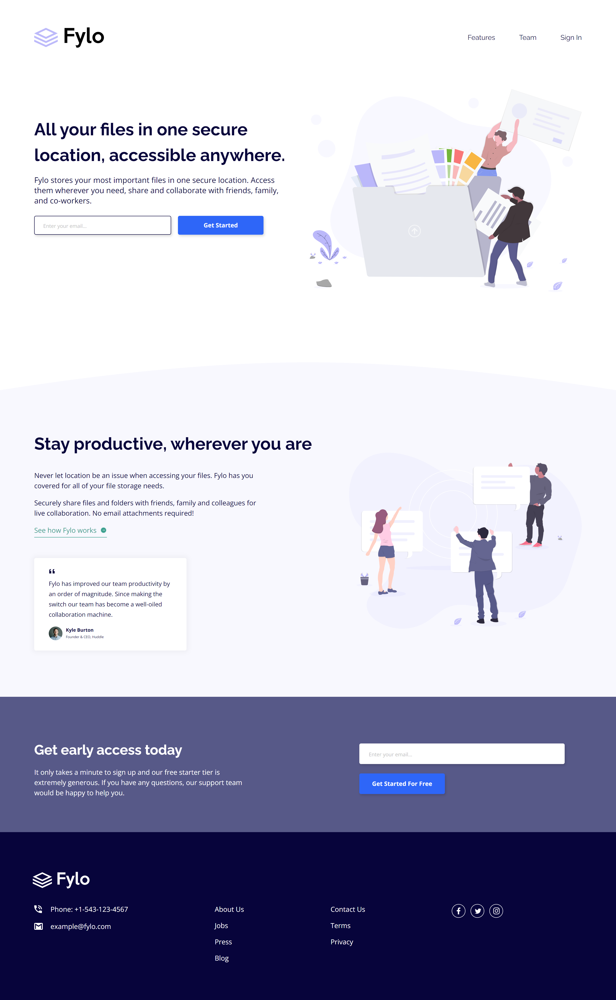

<h1>Fylo landing page</h1>

This is my second project using Tailwind CSS

[Live URL](https://ivaberiashvili.github.io/fylo-landing-page/) | [Solution]() | [Challenge on Frontend Mentor](https://www.frontendmentor.io/challenges/fylo-landing-page-with-two-column-layout-5ca5ef041e82137ec91a50f5)
:-------------------------:|:-------------------------:|:-------------------------:

## The challenge

Users should be able to:

- View the optimal layout for the site depending on their device's screen size
- See hover states for all interactive elements on the page
- interact with email submit and get correct validation message 

## The Solution

### Built with

- Semantic HTML
- Tailwind CSS
- JavaScript
- Mobile-first workflow

### Author
- [Iva](https://github.com/ivaberiashvili/)

